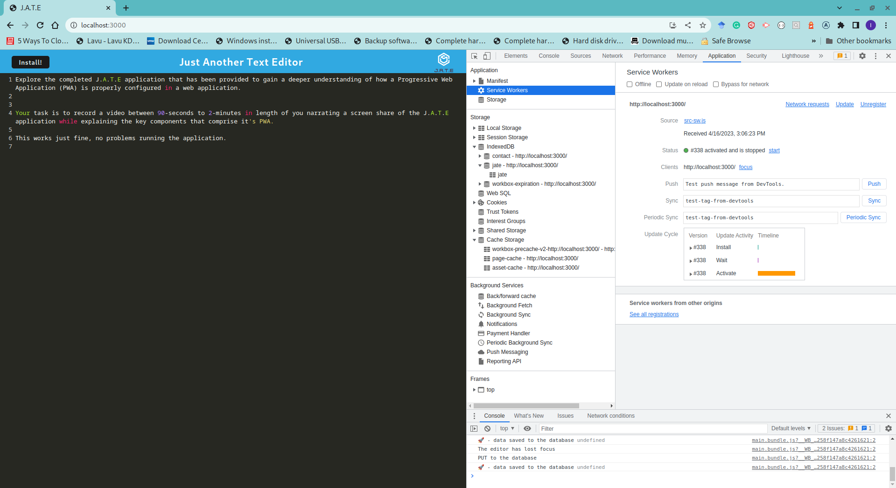

# JUST ANOTHER TEXT EDITOR (J.A.T.E) PROGRESSIVE WEB APPLICATION

      

## Description

This project creates a Text Editor Progressive Web Application (PWA) using Webpack, Workbox, and IndexedDB. The application allows the user to create notes that are saved in real-time without the user required to save their changes. The application also remains fully functional without network connectivity and all changes made offline gets saved once the network gets reconnected. 

## User Story

```md
AS A developer
I WANT to better understand how a PWA is setup
SO THAT I can explain the purpose in a technical setting
```

## Acceptance Criteria

```md
GIVEN a completed text editor web application
WHEN I showcase the application in the video
THEN I should be able to explain all aspects of a PWA
WHEN I show the webpack plugins
THEN I explain how I have a generated HTML file, service worker, and a manifest file
WHEN I open the text editor
THEN I show that IndexedDB has immediately created a database storage
WHEN I enter content and subsequently click off of the DOM window
THEN I explain how the content in the text editor has been saved with IndexedDB
WHEN I reopen the text editor after closing it
THEN I explain how the content in the text editor has been retrieved from our IndexedDB
WHEN I load my web application
THEN I should have, and can explain, the registered service worker using workbox
```

## Table of Contents

- [Description](#description)
- [Installation](#installation)
- [Usage](#usage)
- [Questions](#questions)
- [License](#license)

---

## Installation

To run setup the backend of the application, you will need to install Node.js and once installed, you will run the following command in the root directory of the application:

- npm install

This command will install all dependencies found in the package.json file required by the application to execute. Once all the packages are successfully installed, you are ready to start the server for the API. You wil build the client output and start the server with the command below:

- npm run build
- npm run start:dev

## Usage

Open a browser and enter the address of the server followed by the port number specified in the server configuration.


This link shows an explanation of the J.A.T.E Progressive Web Application: [Demonstration video of Just Another Text Editor Progressive Web App](https://drive.google.com/file/d/15kV_6gjQRvNevKPk5ZzbD4XqWlCRGviK/view?usp=sharing).

The picture below shows landing page of the application


This picture shows a user adding contents to the application. 


This page shows the application demonstrating its ability to be installed as a native desktop application.


This page displays the application's manifest in a browser.


The page shows the application's service worker installed, activated, and waiting to execute new tasks.



The application uses the IndexedDB service to store user data as local database container.


## Questions

If you have any questions, please feel free to reach out to me at: [ikubiti@icloud.com](mailto:ikubiti@icloud.com).

Alternatively, you may find me on GitHub at [https://github.com/ikubiti](https://github.com/ikubiti).

---

## License

Copyright (c) ikubiti. All rights reserved.

Licensed under the [MIT](./LICENSE) license.